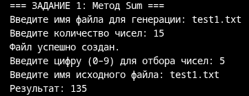
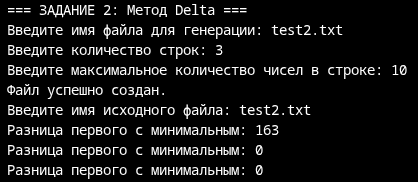
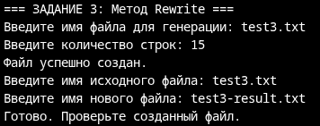
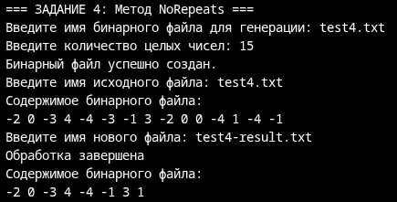
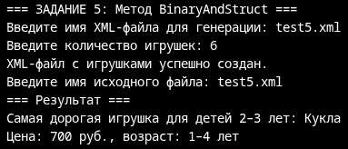
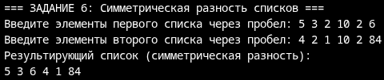
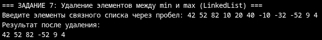
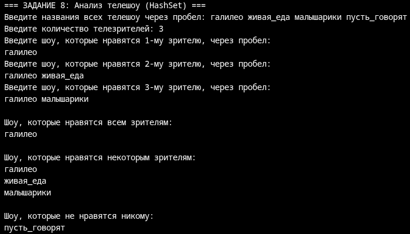
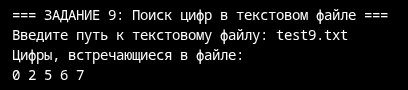
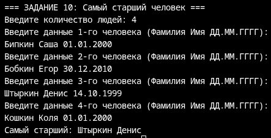

# Абдульманов Алмаз КМБ-1 Лабораторная №7

# Задание 1

## Задача 13

### Текст задачи

Найти сумму элементов, оканчивающихся на заданную цифру.

### Алгоритм решения

Создаём файл с случайными целыми от -1000 до 1000 в каждой строке. Считываем каждую строку файла как целое число, получаем остаток от деления на 10, пока он больше 10. Если он равен заданному, то суммируем.

### Тестирование

# Задание 2

## Задача 13

### Текст задачи

Найти разность первого и минимального элементов.

### Алгоритм решения

Создаём файл на заданное кол-во строк с случайным кол-вом целых чисел, но не более заданного. Для каждой строки перебираем все элементы, начиная с первого в поисках минимального. Вычитаем из первого минимальный.

### Тестирование

# Задание 3

## Задача 13

### Текст задачи

Переписать в другой файл строки, в которых нет знаков препинания.

### Алгоритм решения

Создаём файл с заданным кол-вом строк, в каждой из которых случайное кол-во слов и знак пунктуации в конце. Перебираем все строки, в каждой строке проверяем наличие каждого знака препинания. В случае их отсутствия переписываем строку в новый файл.

### Тестирование

# Задание 4

## Задача 13

### Текст задачи

Из исходного файла получить новый файл, исключив повторные вхождения чисел. Порядок следования чисел сохранить

### Алгоритм решения

Создаём файл с заданным кол-вом случайных целых чисел. Для каждого числа проверяем было ли оно ранее, если нет, то записываем в файл и заносим в список для дальнейшего учёта.

### Тестирование

# Задание 5

## Задача 13

### Текст задачи

Файл содержит сведения об игрушках: название игрушки, ее стоимость в рублях и возрастные границы (например, игрушка может предназначаться для детей от двух до пяти лет). Получить название самой дорогой игрушки, подходящей детям двух-трех лет.

### Алгоритм решения

Создаём XML файл с заданным кол-вом игрушек и случайными значениями полей name, price, minAge, maxAge. Считываем файл и для каждой игрушки проверяем условия по возрасту. Если подходит, то добавляем в список. Проходимся по списку в поиске игрушки с максимальной ценой.

### Тестирование

# Задание 6

## Задача 13

### Текст задачи

Составить программу, которая формирует список L включив в него по одному разу элементы, которые входят в один из списков L1 и L2, но в то же время не входит в другой из них.

### Алгоритм решения

Считываем с клавиатуры списки целых чисел L1 И L2. Для каждого элемента из L1 или L2 проверяем на вхождение в противоположный список. Если не встретился, то заносим в L3. 

### Тестирование

# Задание 7

## Задача 13

### Текст задачи

Удалить все элементы между минимальным и максимальным элементами

### Алгоритм решения

Считываем связный список целых чисел с клавиатуры. Перебираем все элементы и находим максимум и минимум. В случае, если минимальный стоит после максимального, то меняем указатели "начала" и "конца" удаления местами. Удаляем все элементы между ними.

### Тестирование

# Задание 8

## Задача 13

### Текст задачи

Есть перечень названий телевизионных шоу. Определить для каждого наименования шоу, какие из них нравятся всем n телезрителям, какие — некоторым из телезрителей, и какие — никому из телезрителей.

### Алгоритм решения

Считать все шоу как HashSet. Для каждого зрителя считать шоу, которые ему нравятся как HashSet. Изначально считать, что всем нравятся все шоу, но перебирая всех зрителей оставлять только те шоу, которые одновременно нравятся конкретному и находятся в HashSet, хранящем шоу, которые всем нравятся. Для шоу, которые нравятся хоть кому-то изначально считать пустым, и всегда определять как объединение шоу, которые нравятся конкретному зрителю с итоговым HashSet. Из полученного HashSet для шоу, которые нравятся хоть кому-то вычесть шоу, которые нравятся всем. Для шоу, которые не нравятся всем считать изначально все, а потом вычесть шоу, которые нравятся кому-то и шоу, которые нравятся всем.

### Тестирование

# Задание 9

## Задача 13

### Текст задачи

Файл содержит текст на русском языке. Какие цифры встречаются в тексте?

### Алгоритм решения

Открыть файл, считать строку, в строке найти цифры, добавить их в HashSet, поэлементно вывести HashSet. 

### Тестирование

# Задание 10

## Задача 13

### Текст задачи

Имеется список людей с указанием их фамилии, имени и даты рождения. Напишите программу, которая будет определять самого старшего человека из этого списка и выводить его фамилию и имя, а если имеется несколько самых старших людей с одинаковой датой рождения, то определять их количество. На вход программе в первой строке подается количество людей в списке N. В каждой из последующих N строк находится информация в следующем формате:
    <Фамилия><Имя><Дата рождения>
где <Фамилия> – строка, состоящая не более, чем из 20 символов без пробелов, <Имя>– строка, состоящая не более, чем из 20 символов без пробелов, <Дата рождения> – строка, имеющая вид ДД.ММ.ГГГГ, где ДД – двузначное число от 01 до 31, ММ – двузначное число от 01 до 12, ГГГГ – четырехзначное число от 1800 до 2100.
Пример входной строки:
    Иванов Сергей 27.03.1993
Программа должна вывести фамилию и имя самого старшего человека в списке.
Пример выходных данных:
    Иванов Сергей
Если таких людей, несколько, то программа должна вывести их количество. Пример вывода в этом случае:
    3

### Алгоритм решения

Считать людей, в SortedList<DateTime, List<string>> по датам. Считаем сколько людей с самой ранней датой. Если 1, то выводим имя и фамилию, иначе выводим их кол-во.

### Тестирование

